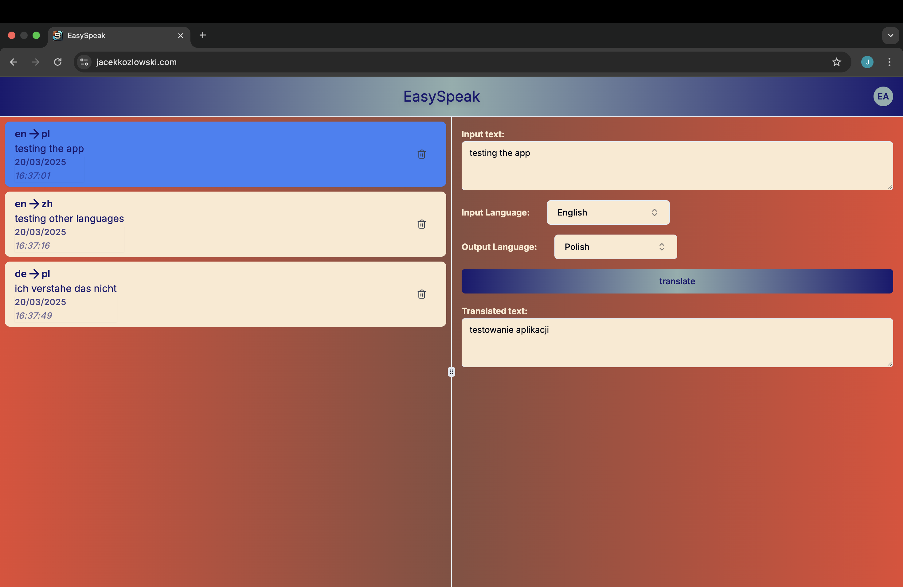

# TypeScript Translator with AWS

This project is a translation application built in TypeScript, utilizing AWS for processing translations. The project consists of a frontend part and infrastructure managed using AWS CDK.
## Tech Stack

- **Languages & Frameworks**:
  - TypeScript/JavaScript
  - HTML/CSS
  - TailwindCSS
  - React/NextJS

- **AWS Services**:
  - Lambda
  - Lambda Layer
  - DynamoDB
  - Route53
  - Cognito
  - S3

- **Tools & Libraries**:
  - AWS SDK v3
  - NPM/Monorepo using workspaces
  - shadcn/ui for components

## Project Structure

- `apps/frontend` - Frontend code built with Next.js
- `infrastructure` - Infrastructure code managed using AWS CDK
- `packages` - Additional packages and shared types used in the project

## Commands

Start the frontend development environment (localhost) from the root directory:
```bash
npm run frontend:dev
```

Build the frontend for production from the root directory:
```bash
npm run frontend:build
```

Deploy the infrastructure on AWS from the root directory:
```bash
npm run cdk:deploy
```

Destroy the infrastructure on AWS from the root directory:
```bash
npm run cdk:destroy
```

## Usage

The project uses AWS Translate to process text translations. You can use the frontend interface to input text for translation. 


**Test Login Credentials:**

- **Email**: easyspeaktest@gmail.com
- **Password**: Easyspeak123!

Visit [jacekkozlowski.com](https://jacekkozlowski.com) to see the application in action.

